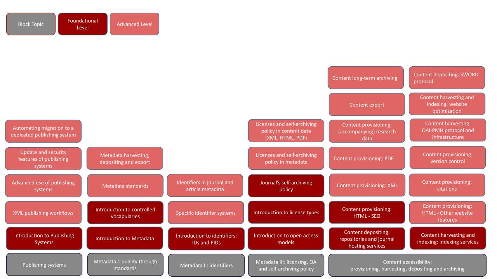

| **Deliverable Title**                   | Reusable curriculum for upskilling trainings \[on Diamond OA standards and technologies]    | 
| - | - | 
| **Deliverable No.**                     | D2.2 
| **Due Date**                            | 2024.03.31
| **Submission Date**                     | 2024.04.04
| **Version**                              | 1.0 - Final  
| **Lead beneficiary**                    | 02\_OPERAS                                       
| **Contributing WP**                     | WP2                                             
| **Type**                                | DEC —Websites, patent filings, videos, etc.     
| **The level of dissemination according to GA**| PU (Public)
|  | 
HORIZON-INFRA-2022-EOSC-01

Grant Agreement: 101094397

| **Project Full Title** | Creating a Robust Accessible Federated Technology for Open Access                                                                                                                                                                          |
| ---------------------- | ------------------------------------------------------------------------------------------------------------------------------------------------------------------------------------------------------------------------------------------ |
| **Project Acronym**    | CRAFT-OA                                                                                                                                                                                                                                   |
| **Project No.**        | 101094397                                                                                                                                                                                                                                  |
| **Start Date**         | 2023.01.01                                                                                                                                                                                                                                 |
| **End Date**           | 2025.12.31                                                                                                                                                                                                                                 |
| **Duration**           | 36 Months                                                                                                                                                                                                                                  |
| **Project Website**    | https://craft-oa.eu                                                                                                                                                                                                                        |
| **Authors**            | 
Maxim Kupreyev (https://orcid.org/0000-0002-8472-6954),

Jorina Fenner (https://orcid.org/0009-0001-0469-3110),

Lisa Müller (https://orcid.org/0009-0008-3029-1888)
                                                      |
| **Abstract**           | This deliverable provides the reusable curriculum for upskilling trainings developed within T2.2 and details the background of the curriculum, how to use the curriculum and recommendations for the organisation of upskilling trainings. |

**Version and Revision History**

| Version | Date       | Author/Reviewer/Contributors                                                        | Comments                                 |
| ------- | ---------- | ----------------------------------------------------------------------------------- | ---------------------------------------- |
| 0.1     | 19.03.2024 | 
Authors: Maxim Kupreyev (OPERAS), Jorina Fenner (TIB), Lisa Müller (UGOE)
 | Version sent to reviewers                |
| 0.2     | 25.03.2024 | 
Reviewers: Karla Avanço, Antti-Jussi Nygård, Margo Bargheer
               | Review                                   |
| 0.3     | 03.04.2024 | 
Authors: Maxim Kupreyev (OPERAS), Jorina Fenner (TIB), Lisa Müller (UGOE)
 | Final text, handed over for formal check |
| 0.4     | 05.04.2024 | Tabea Klaus (UGOE), Lisa Müller (UGOE)                                              | Final formal check                       |
| 1.0     | xxxx.xx.xx |                                                                                     |                                          |

This deliverable is licensed under a Creative Commons Attribution 4.0 International License.

**List of Acronyms**

| TIB     | Technische Informationsbibliothek                                                         |
| ------- | ----------------------------------------------------------------------------------------- |
| UGOE    | Universität Göttingen                                                                     |
| D       | Deliverable                                                                               |
| T       | Task                                                                                      |
| WP      | Work Package                                                                              |
| IPs     | Institutional Publishers                                                                  |
| IPSPs   | Institutional Publishing Service Providers                                                |
| IPTPs   | Institutional Publishing Technical Providers                                              |
| OADJS   | Open Access Diamond Journal Study                                                         |
| OADJ    | Open Access Diamond Journal                                                               |
| OA      | Open Access                                                                               |
| EOSC    | European Open Science Cloud                                                               |
| DIAMAS  | Developing Institutional Open Access Publishing Models to Advance Scholarly Communication |
| OJS     | Open Journal Systems                                                                      |
| DOAJ    | Directory of Open Access Journals                                                         |
| EQSIP   | Extensible Quality Standard for Institutional Publishing                                  |
| ERA     | European Research Area                                                                    |
| ROR     | Research Organization Registry                                                            |
| SRCE    | University of Zagreb University Computing Centre                                          |
| AMU     | University of Marseille                                                                   |
| IBL PAN | The Institute of Literary Research of the Polish Academy of Sciences                      |
| TSV     | Tieteellisten seurain valtuuskunta                                                        |
| DOI     | Digital Object Identifier                                                                 |
| COAR    | Confederation of Open Access Repositories                                                 |
| SWORD   | Simple Web-service offering Repository Deposit                                            |
| ORCID   | Open Researcher and Contributor ID                                                        |
| PID     | Persistent Identifier                                                                     |
| UNIZD   | University of Zadar                                                                       |
| D3.2    | Deliverable D3.2 of CRAFT-OA                                                              |
| D3.1    | Deliverable D3.1 of CRAFT-OA                                                              |

Table of Contents

1 Executive Summary 6

**2 Introduction 6**

**3 Background of the Reusable Upskilling Curriculum 7**

**4 How to use the Upskilling Curriculum 11**

**5 Upskilling Curriculum 14**

5.1 Publishing systems and their features 14

5.1.1 Suggested training topics 14

5.1.2 Notes on the training topics 14

5.1.3 Modules build-up: Publishing Systems and their Features 15

5.1.4 Training materials 15

5.2 Metadata I: quality through standards 17

5.2.1 Suggested training topics 17

5.2.2 Notes on the training topics 18

5.2.3 Modules build-up: metadata i - quality through standards 19

5.2.4 Training materials 20

5.3 Metadata II: identifiers 21

5.3.1 Suggested training topics 21

5.3.2 Notes on the training topics 21

5.3.3 Modules build-up: metadata ii - identifiers 22

5.3.4 Training materials 23

5.4 Metadata III: licensing, OA and self-archiving policy 24

5.4.2 Notes on the training topics 24

5.4.3 Modules build-up: metadata iii - copyright and licensing 24

5.4.4 Training materials 25

5.5 Content accessibility 26

5.5.1 Suggested training topics 26

5.5.2 Notes on the training topics 26

5.5.3 Modules build-up: content accessibility i - provisioning, harvesting, depositing and archiving 28

5.5.4 Training materials 29

5.6 Upskilling curriculum: modular break-up and a checklist 30

5.6.1 Modular break-up 30

5.6.1 Curriculum check-list 31

**6 Guidelines for Organizing Upskilling Trainings 33**

6.1 General organization of trainings 33

6.1.1 Where to begin: the definition of objectives and target groups 33

6.1.2 How to continue: the evaluation of resources 35

6.1.3 Further aspects: deciding the details of the training 35

6.1.4 Where to end: preparation of training materials and outcomes documentation 36

6.1.5 Checklist for training planning 36

6.2 Content structure in trainings 38

6.2.1 Start of the training - introduction and welcome 38

6.2.2 Core of the training - formats and methods 39

6.2.3 End of the training - conclusion and goodbye 40

6.2.4 Optional component - after work 40

List of References 42

List of Figures 43

List of Tables 43

### 1 Executive Summary 

The training needs of Open Access Journal editors, reviewers, Institutional Publishing Service Providers (IPSPs) and Institutional Publishing Technical Providers (IPTPs) are as diverse as the technical standards they are confronted with. The deliverable “D2.2 Reusable curriculum for upskilling trainings” provides a modular framework for upskilling qualification in technical topics and takes into account the variety of publishing environments in which they occur. In addition to suggesting the training topics, the deliverable elaborates on their contents, presents existing training materials and provides practical recommendations for organising and structuring a training. To each training topic a potential target audience, a user level and a FAIR principle is assigned. A succinct information on training topics is presented in the curriculum checklist, which can be used as a backbone of the upskilling agenda. The curriculum is thus designed to be adapted to the context and to the mode of the training.

### 2 Introduction 

The landscape of Open Access Diamond Journal providers is highly diverse in terms of the geographical distribution, available resources and technical knowledge. The deliverable D2.2 “Reusable curriculum for upskilling trainings” created within the CRAFT-OA task “T2.2 Community Support Framework” offers a starting point in the upskilling process of relevant stakeholders. It is first and foremost aimed at Open Access Journal editors, reviewers and technical professionals, as well as Institutional Publishing Service and Technology Providers staff\[1]. The list of potential target groups can be extended with, e.g., software developers and researchers involved in academic publishing initiatives, research performing organisations, infrastructures and libraries.\[2] The curriculum might also be useful for the upskilling of audiences who do not directly interact with the technical aspects of their respective platforms.

The curriculum provides a framework for closing the technical gaps that were defined in the “Report on challenges and help measures faced by Open Access journals and platforms” (D3.2 of CRAFT-OA, chapter 3). The curriculum topics were aligned with these findings, which serve as building blocks for its content. The modular structure allows adapting and customising its components to the individual needs and requirements of the participants of a training (chapter 4). The syllabus assigns topics to the broader thematic areas, and suggests related training materials which are either already existing or planned to be produced by CRAFT-OA project (chapter 5).

Changing the perspective from the trainees to the trainers, the curriculum offers guidelines on the organisational side of a potential upskilling event (see chapter 6). These formalise the planning process, training’s objectives, target groups, the available resources and evaluation. In addition, the guidelines define the training structure and workflow, providing practical instructions to the institutions willing to utilise the contents of the D2.2.

Taking inspiration from the “[Extensible Quality Standard in Institutional Publishing (EQSIP) V2.0 for Diamond Open Access](https://zenodo.org/doi/10.5281/zenodo.10726731)”, the upskilling topics are summarised in a check-list. A graphic on the break-up of the training modules helps to visualise the division of topics in foundational and advanced levels.

### 3 Background of the Reusable Upskilling Curriculum 

The diversity of actors in the Open Access Diamond Journal (OADJ) landscape served both as a cause and a motivation for the creation of the Reusable Upskilling Curriculum, which presents a starting point for those involved in institutional Open Access (OA) publishing and wishing to expand their technical expertise. The curriculum was designed taking into account the current difficulties of the OADJ community in embracing the established technical standards. It provides a list of existing training material and offers general guidelines which may act as a first step for upskilling as well as inspiration for creating or delivering training.

The CRAFT-OA deliverable D3.1 “[Report on Standards for Best Publishing Practices and Basic Technical Requirements in the Light of FAIR Principles](https://zenodo.org/doi/10.5281/zenodo.8112661)” (Armengou et al. 2023a) conducted an extensive review of the variety of technical standards. In their analysis the authors systematically examined the following documents\[3]:

* the Directory of Open Access Journals (DOAJ) inclusion criteria\[4],
* the Plan S requirements for publication venues\[5],
* the OpenAIRE Guidelines for Literature Repository Managers v4\[6],
* the Extensible Quality Standard for Institutional Publishing (EQSIP) V1.0\[7]
* the EOSC Interoperability Framework Guidelines\[8].

Based on the standards outlined in the D3.1 report, the same working group published “[D3.2 Report on challenges and help measures faced by OA journals and platforms](https://zenodo.org/doi/10.5281/zenodo.10496593)”\[9] (Laakso et al. 2024). This document summarised the standards and requirements that the OADJ community has difficulties implementing in their publishing practices. The core components of the Reusable Upskilling Curriculum presented here are therefore based on the D3.2 study.

An additional resource that informed D3.2 were preliminary results of the 2023 DIAMAS survey (Armengou et al. 2023b) which was conducted between March and May 2023 and contains responses by 685 institutions involved in publishing within the European Research Area (ERA). In their synopsis of the report Arasteh and Blake (2024, p.5) fittingly dub the OADJ community “a largely fragmented archipelago”\[10]. Nevertheless, the authors provide a number of features that the community has in common: institutional publishers maintain high editorial standards and adhere to open science values; many are operating within a small budget and print a limited number of journals and publications; they dispose of restricted professionals hours and often rely on the work of volunteers (Arasteh & Blake, 2024, p. 7). This supports the findings of the Open Access Diamond Journal Study (OADJS) that showed a budget of below 10,000€ as the financial base for over 60% of the journals that were surveyed (Bosman et al., 2021, p. 110).

With the limited resources of OADJs in mind, the Reusable Upskilling Curriculum is conceptualised to group the variety of challenges faced by OADJs into manageable modules. In this way, the users - both trainers and trainees - can select a topic and the level of complexity in accordance with their needs and resources. The curriculum offers trainers a comprehensive framework to organise training; it also allows the trainees to identify their upskilling needs more precisely. Recommendations on how to use the Reusable Upskilling Curriculum are provided in chapter 4.

One overarching issue that influences the way in which OADJs work is the publishing software. Although no technical quality standard such as EQSIP or Plan S recommends a certain system, the use of a specifically designed software for journal publishing often enables OADJs to adhere to the standards in a fundamentally easier way. The DIAMAS survey responses to the question what software the institutional publishers utilise, show a gap in the implementation of specialised publishing systems, with 9.7% running on Wordpress and 7.5% unaware of the solution they use. (Laakso et al., 2024, p. 24). The compilation of standards supported by OJS, Janeway and Lodel carried out in D3.2 (Laakso et al. 2024) highlighted that many of the standards are covered by the respective publishing solutions. Hence, the upskilling curriculum is heralded by a section that specifically addresses publishing software solutions. It provides an introduction to the publishing systems and includes some of the topics for advanced use, such as the update and security features. The survey recently carried out in Task 4.4 of CRAFT-OA (“Simplification of installation and update procedures”) found out that two of the most frequently reported issues with OJS are updating (60%) and security concerns (46%)\[11]. Further advanced topics offered within this block are XML publishing workflows, which can be useful for those IPs who provide not only submission workflow but also layout, typesetting and annotation services.

Both Laakso et al. (2024) and Armengou et al. (2023b) found additional challenges in the field of metadata. High quality metadata and its provisioning in established formats significantly influence a journal’s findability and accessibility. The DIAMAS survey (Armengou et al. 2023b, p. 139) made clear that next to a lack of human resources, missing expertise is seen as a major obstacle by IPSPs in delivering quality metadata. In the Reusable Upskilling Curriculum this aspect is approached from three perspectives:

* Metadata quality through standards
* Identifiers
* Licensing, OA and self-archiving policy

Within the block “Metadata I: quality through standards”, common metadata schemes are introduced along with methods and infrastructures for metadata harvesting, depositing and export. This mirrors the observation of the DIAMAS survey that „metadata export and sharing is not a standard practice among IPSPs” (Armengou et al., 2023b, p. 134), even though it is required under several quality standards (cf. e.g. Armengou et al. 2023a, p.30-31). This block also embraces the topic of the controlled vocabularies, which allow the systematic and homogeneous description of the resources.

Identifiers are regarded as crucial for successful indexation and attribution of authors, funders as well as journals. While some identifiers like DOIs already show a relatively high uptake, the Research Organization Registry (ROR) identifier needs more awareness even if it was recently adopted by Crossref (Laakso et al., 2024, p. 32). To allow for low-threshold first steps into the topic, the block “Metadata II: identifiers” suggests a general introduction to IDs and their digital pendants PIDs as well as their rendering in different metadata standards (DC, MARC, etc.). In the next step a more detailed explanation of each identifier system can be given (ISSN, DOI, ROR, etc).

At first glance, guidelines concerning copyright and licensing may appear as policy related topics rather than a technical challenge. However, the technical provisioning of metadata under CC0 licence or the registering of self-archiving policies, e.g. on the website, still pose challenges (Laakso et al., 2024, p. 55). The third thematic area “Metadata III: licensing, OA and self-archiving policy” therefore provides an introduction to licence types and open access models, used for publications but also for the accompanying datasets and software. Two further topics touch upon licences and open access status declared in metadata and in different output formats, such as XML, HTML and PDF. Finally, a further gap identified in D3.2 (§3.2.6) is outlined - the journal’s self-archiving policy.

The vast and intertwined field of content accessibility shapes the fifth block of the Reusable Upskilling Curriculum. It is devoted to the content provisioning, harvesting, indexing, depositing and archiving. The topic of content provisioning in different formats, especially the machine-readable ones, was added to the curriculum in response to several previous findings: OADJS reported that smaller journals in SSH cluster were experiencing difficulties with offering articles in XML or HTML format (Bosman et al., 2021, p. 63). Similarly, Laakso et al. (2024, p.67) conclude that in the DIAMAS survey only 19% of respondents indicated dissemination in an XML format, although all publishing software types that were examined supported the use of XML. Whether this software support refers to the production of XML files, e.g. through conversion from other formats, or solely to the ability to handle (i.e. to unload and publish) XML is not entirely clear. However, the apparent gap between OADJs practices and technical possibilities strongly indicates a need for upskilling training. Content provisioning also embraces the website's HTML features, introduced by the hands-on recommendations for the website’s search engine optimization for the aggregators (e.g. Google Scholar). Citations constitute an integral part of the open linked data and their proper delivery helps to raise the overall quality of the publication. The curriculum thus covers the Open Citations Standard, formalising the citations accessibility in metadata (e.g. by its publishing on Crossref) as well as proper referencing in other output formats such as PDF and HTML.

The OADJS underlines that “the biggest problem of small editors in OA is the lack of lobbying for the inclusion in important databases which could contribute to readings and impact increase of the journal.“ (Bosman et al., p. 84). From a technical point of view Bosman et al. (2021, p. 101) conclude that indexation is the main technical challenge for diamond journals. For the European Research Area (ERA) this finding is supported by the DIAMAS survey which asked about the satisfaction of participants with their indexing: 54% indicated that they would like it to be better (Armengou et al., 2023b, p. 144-143). In light of these challenges the section “Content harvesting and indexing” gives the overview of the existing indexing/aggregator services and their requirements, supplemented by the advice for indexing optimization. The technical set-up of the OAI-PMH infrastructure and protocol constitute the core of the training topic on content harvesting. Content depositing to the repositories via SWORD protocol and export in different formats suitable for data mining establish further training areas. Laakso et al. (2024, p.73) present challenges in the area of long-term preservation of content, with only half of the OADJs enrolled in a digital preservation service. Acknowledging the danger of potentially losing a large number of OADJs for the scholarly record, the Upskilling Curriculum contains a training topic on long-term archiving services.

In addition to the resources cited above, the following documents contributed to the creation of the Reusable Upskilling Curriculum:

* GoTriple Handbook\[12]
* TRIPLE Deliverable: D2.5 - Report on Data Enrichment\[13]
* Mapping the Landscape - Identifying categories of projects, axes on the map, and approaches and trends in OSS\[14]
* Overview of the technical standards (a working document for D3.1 (Argmengou et al 2023a))\[15]
* Diamas D3.2 “Extensible Quality Standard in Institutional Publishing (EQSIP) V2.0 for Diamond Open Access”\[16]

### 4 How to use the Upskilling Curriculum 

The curriculum is organised in thematic blocks, which summarise technical gaps faced by the Open Access journals and are largely based on the findings of the Craft-OA Deliverable 3.2. The blocks are as follows:

* Publishing systems and their features (§ 5.1)
* Metadata I: quality through standards (§ 5.2)
* Metadata II: identifiers (§ 5.3)
* Metadata III: licensing , OA and self-archiving policy (§ 5.4)
* Content accessibility (§ 5.5)

The first chapter (x.1) of each block is entitled “Suggested training topics” and presents a list of the relevant training topics, organised thematically into sections. For example, the thematic sections of the block “§5.5 Content accessibility” include “Content provisioning”, “Content harvesting and indexing”, “Content depositing and export” and “Content long-term archiving”.

The second chapter (x.2, “Notes on training topics”) explains in detail the reasons for choosing particular topics, their naming conventions, and the logic of their assignment to specific sections.

The third chapter (x.3, “Modules build-up”) takes on combining the topics into different training modules. Apart from the thematic blocks, it stipulates that a concrete build-up and the scope of the upskilling training might depend on:

* The knowledge level of the audience
* The type of the audience
* The practical objective of the training
* The theoretical framework used (e.g., FAIR principles)\[17]
* The publishing system the audience uses.
* etc.

The chapter therefore assigns topics to the following training categories:

* Knowledge level of the target group:
  * Foundational
  * Advanced
* FAIR aspects:
  * “F” for Findable
  * “A” for Accessible
  * “I” for Interoperable
  * “R” for Reusable

In addition, the curriculum designates a potential target audience for each topic, taking into account that the “division of labour” within smaller OADJs may not be precise: individuals may belong to more than one target audience and the responsibilities may overlap. For example, editors may also fulfil the duties of technical professionals. Alongside the different roles it also includes a list of potential institutions whose members may be considered as target groups for upskilling training.

The schema for the audience types used in the curriculum derives from CRAFT-OA Deliverable 7.1 “Communication and Dissemination Plan” (Arasteh et al. 2023). The modular build-up of the curriculum will only include the roles as part of the audience attribution, leaving their institutional affiliations aside.

| **Role**                                                                                                           | **Institutions**      |                                                                                                                           |                                                                                                                                                                                                                                                                             |
| ------------------------------------------------------------------------------------------------------------------ | --------------------- | ------------------------------------------------------------------------------------------------------------------------- | --------------------------------------------------------------------------------------------------------------------------------------------------------------------------------------------------------------------------------------------------------------------------- |
| 
● Editors

● Reviewers

● Researchers

● Software developers

● Technical professionals
 | ● Diamond OA Journals | 
● Institutional Publishing Service Providers (IPSPs)

● Institutional Publishing Technology Providers (IPTPs)
 | 
● Research libraries

● Publishing initiatives/projects in academia

● Research Infrastructures

● Research Performing Organisations (RPOs) / Funders

● Small and Medium Enterprises (SME) service providers in Diamond OA

● Policymakers
 |

Table 1: Target audiences for upskilling training

For example, the topics of the block “5.4 Metadata III: licensing, OA and self-archiving policy” belong to the following modules:

| **Topic**                                                                                              | **Level**    | **Audience**                                                 | **F-A-I-R** |
| ------------------------------------------------------------------------------------------------------ | ------------ | ------------------------------------------------------------ | ----------- |
| Introduction to open access models: Green, Gold and Diamond OA                                         | Foundational | 
● Editors

● Reviewers

● Researchers
       | A-R         |
| Introduction to license types: Creative Commons, MIT license, GNU                                      | Foundational | 
● Editors

● Reviewers

● Researchers
       | A-R         |
| Journal’s self-archiving policy                                                                        | Foundational | 
● Editors

● Reviewers

● Researchers
       | A-R         |
| Setting up the publishing system: Licenses and self-archiving policy in metadata.                      | Advanced     | 
● Software developers

● Technical professionals
 | A-R         |
| Setting up the publishing system: Licenses and self-archiving policy in content data (XML, HTML, PDF). | Advanced     | 
● Software developers

● Technical professionals
 | A-R         |

The attribution is not binding, in fact, some of the topics may be taught on both levels, and the upskilling itself might be built with another perspective in mind. D3.2, for instance, additionally mentions whether given technical requirements are supported by the publishing systems such as OJS, Janeway and Lodel. The publishing software thus presents another potential axis for the training curriculum. It is therefore recommended to use the check-list in chapter § 5.6 and combine the desired topics into required modules.

Finally, chapter four (x.4) attempts to assign the existing training materials to the thematic blocks of the curriculum. Considering the interlocking of many topics and their scopes the assignment is not prescriptive but should be viewed as a recommendation. In the same vein, the learning material planned to be produced by CRAFT-OA is allocated to the curriculum sections. The reader is advised to keep in mind the existence of PKP Docs directory, containing the user guides, developer documentation and publishing tips for all of the Public Knowledge Project’s software topics.\[18]

### 5 Upskilling Curriculum 

The following curriculum is organised thematically into training blocks, which are further split into sections and topics. The coordinator of training may either use the list as such, or combine the content into different modules according to their needs or contexts.

#### 5.1 Publishing systems and their features 

**5.1.1 Suggested training topics**

1. Introduction to common publishing systems
2. Advanced use of publishing systems:
   1. Introduction to the advanced use of publishing systems
   2. Update and security features of publishing systems
   3. Automating migration to a dedicated publishing system
3. XML publishing workflows

**5.1.2 Notes on the training topics**

The report on technical challenges and gaps in journal operations (Laakso et al. 2024) specifically states that the use of the open publishing systems could alleviate the difficulties journals experience adhering to common publishing standards:

_Many standards would almost automatically be fulfilled if the journal would reside on a modern publishing content management system rather than something self-built or a generic website framework not tailored to publishing specifically. (p. 108)_

The course block offers a foundational and advanced level upskilling on commonly used publishing systems (e.g. OJS, Lodel, Janeway). The background of the foundational course is the overall functionality of the system from the perspective of the editors and reviewers with the focus on the editorial workflow. As a part of the advanced course the update procedure and the security features will be covered, as necessitated by the recently conducted survey on OJS technical requirements (see above).

The presence of the third topic - “XML publishing workflows” - is conditioned by the fact that some publishing systems offer not only a submission workflow and a publishing service, but also authoring-editing, layout, typesetting and annotation\[19]. These features are commonly based on XML datasets, which are converted into different output formats such as HTML, PDF and ePub. This training topic covers XML publishing workflows either on a selected publishing platforms (e.g. TEI Publisher) or platform-independent, using XML editing software such as Oxygen XML. An introduction to XSLT and CSS may constitute part of the training, as the transformation scenarios mostly include XSL templates. The level of detail with which the different technologies are covered may vary to serve the needs of the target audience. For instance, a “train the trainer” format would require a different approach than a training of editors.

**5.1.3 Modules build-up: Publishing Systems and their Features**

| **Topic**                                              | **Level**    | **Audience**                                                          | **F-A-I-R** |
| ------------------------------------------------------ | ------------ | --------------------------------------------------------------------- | ----------- |
| Introduction to publishing systems                     | Foundational | <ul><li>Editors</li><li>Reviewers</li><li>Researchers</li></ul>       | F-A-I-R     |
| Introduction to the advanced use of publishing systems | Advanced     | <ul><li>Editors</li><li>Reviewers</li><li>Researchers</li></ul>       | F-A-I-R     |
| Update and security features of publishing systems     | Advanced     | <ul><li>Software developers</li><li>Technical professionals</li></ul> | F-A-I-R     |
| Automating migration to a dedicated publishing system  | Advanced     | <ul><li>Software developers</li><li>Technical professionals</li></ul> | F-A-I-R     |
| XML publishing workflows                               | Advanced     | <ul><li>Software developers</li><li>Technical professionals</li></ul> | F-A-I-R     |

Table 2: Modules for the training block “Publishing systems and their features”

**5.1.4 Training materials**

1. Existing training materials.

| **Title**                                                                                                                                                                                                                                             | **Creators**                                                                                                                                                                                                                                                                                   | **Comment**                                                                                                                                                                                                                                                                  |
| ----------------------------------------------------------------------------------------------------------------------------------------------------------------------------------------------------------------------------------------------------- | ---------------------------------------------------------------------------------------------------------------------------------------------------------------------------------------------------------------------------------------------------------------------------------------------- | ---------------------------------------------------------------------------------------------------------------------------------------------------------------------------------------------------------------------------------------------------------------------------- |
| Finding the Right Platform: A Crosswalk of Academy-Owned and Open-Source Digital Publishing Platforms ([https://doi.org/10.17613/z27e-0z11](https://hcommons.org/deposits/item/hc:59231))                                                             | [Cheryl E. Ball](https://hcommons.org/deposits/?facets%5Bauthor\_facet%5D%5B%5D=Cheryl+E.+Ball),[ Corinne Guimont](https://hcommons.org/deposits/?facets%5Bauthor\_facet%5D%5B%5D=Corinne+Guimont) ,[ Matt Vaughn](https://hcommons.org/deposits/?facets%5Bauthor\_facet%5D%5B%5D=Matt+Vaughn) | Published in 2023 this document gives an overview of selected publishing softwares and their features, including the topics “Hosting & Cost, Ingestion Options, Editorial Workflows, Interactivity, Archive & Preservation, Export Options, Discoverability, Accessibility”. |
| Plan S compliance in OJS: Open webinar recording ([https://docs.pkp.sfu.ca/plan-s/en/](https://docs.pkp.sfu.ca/plan-s/en/))                                                                                                                           | PKP                                                                                                                                                                                                                                                                                            | The webinar from November 2022 outlines the steps that journals can take to comply with Plan S requirements in OJS. In addition to the video, there are helpful notes on the website.                                                                                        |
| Guidelines for XML publishing in Hrčak\[20] ([https://wiki.srce.hr/display/HRCAK/Guidelines+for+preparing+a+DOCX+document](https://wiki.srce.hr/display/HRCAK/Guidelines+for+preparing+a+DOCX+document) )                                             | University of Zagreb University Computing Centre (SRCE) as part of CRAFT-OA                                                                                                                                                                                                                    | The documentation gives a step-by-step explanation of how to publish XML files in the Portal of Croatian scientific and professional journals (Hrčak). It also forms the basis for workshops that members of SRCE give as part of CRAFT-OA.                                  |
| Automation of processes for publishing journal issues in OJS ([https://github.com/CHC-Computations/CRAFT-OA-training-materials/tree/main/OJS\_automation](https://github.com/CHC-Computations/CRAFT-OA-training-materials/tree/main/OJS\_automation)) | The Institute of Literary Research of the Polish Academy of Sciences (IBL PAN) as part of CRAFT-OA                                                                                                                                                                                             | This Jupyter notebook contains a Python script to enable the automatic transfer of texts and their metadata to OJS instances. It is used for training delivered during the CRAFT-OA project and may be a valuable resource for advanced users of OJS.                        |
| OA Journals Toolkit: Software and Technical Infrastructure ([https://www.oajournals-toolkit.org/infrastructure/software-and-technical-infrastructure](https://www.oajournals-toolkit.org/infrastructure/software-and-technical-infrastructure))       | DOAJ, OASPA                                                                                                                                                                                                                                                                                    | The article from the OA Journals Toolkit discusses publishing software and possible integrations.                                                                                                                                                                            |
| OA Journals Toolkit: Structured Content ([https://www.oajournals-toolkit.org/infrastructure/structured-content](https://www.oajournals-toolkit.org/infrastructure/structured-content))                                                                | DOAJ, OASPA                                                                                                                                                                                                                                                                                    | The article from the OA Journals Toolkit introduces the advantages and disadvantages of publishing content in a XML format.                                                                                                                                                  |

Table 3: Existing materials for the training block “Publishing systems and their features”

1. Training materials planned to be produced by CRAFT-OA

| **Title**                                                                       | **Planned in the context of**          | **Institution** |
| ------------------------------------------------------------------------------- | -------------------------------------- | --------------- |
| Intro to publishing platforms                                                   | WP3 / T3.3                             | TIB             |
| XML Publishing                                                                  | 2024 summer school for journal editors | TIB / Operas    |
| Advanced use of OJS                                                             | WP3 / T3.3                             | SRCE            |
| Staging and container virtualisation, pro’s and con’s                           | WP3 / T3.3                             | UGOE            |
| Typical journal platform migration processes                                    | WP3 / T3.3                             | UGOE            |
| OJS automation: automatic transfer of texts and their metadata to OJS instances | WP3 / T3.3                             | IBL PAN         |
| SciFlow: HTML and PDF production                                                | WP3 / T3.3                             | UGOE            |

Table 4: Potential materials for the training block “Publishing systems and their features”

#### 5.2 Metadata I: quality through standards 

**5.2.1 Suggested training topics**

1. Introduction to metadata
2. Metadata standards
   1. Dublin Core (simple and qualified)
   2. MARC family (MARC21 and MARC XML)
   3. MODS XML
   4. ONIX XML
   5. JATS XML, TEI XML, Crossref XML
   6. KBART files
   7. OpenAire guidelines
   8. Europeana Data model
   9. Datacite metadata schema
3. Metadata harvesting, depositing and export
   1. OAI-PMH: protocol and infrastructure
   2. SWORD protocol
   3. Mass metadata export
4. Controlled vocabularies
   1. Introduction to controlled vocabularies
   2. COAR Resource Types Vocabulary

**5.2.2 Notes on the training topics**

The goal of this training block is to provide an overview of the common metadata standards and to explain the methods of metadata provisioning, depositing and export. In addition, an introduction to the common controlled vocabularies and the metadata fields to which they are applied can be given. The block is thus split into the following training sections:

1. “Introduction to metadata” is conceptualised as a foundational level topic, which will introduce the existing metadata standards and compare them. It will focus on the common semantic fields, such as “Creator of the resource”, “Identifier of the resource”, “License”, etc., which all standards cover but provide different labels to them, e.g. :

| **Description**                      | 
<strong>Dublin Core</strong>

<strong>Qualified Dublin Core</strong>
 | **OpenAire Format (JSON)** | **Europeana Data Model**                            | **TRIPLE data model** |
| ------------------------------------ | -------------------------------------------------------------------------------- | -------------------------- | --------------------------------------------------- | --------------------- |
| 
Creator of the

resource
 | 
dcterms:creator

dc:creator
                                          | author/fullname            | dc:creator                                          | schema:author         |
| Identifier of the resource           | 
dcterms:identifier

dc:identifier
                                    | id                         | dc:identifier                                       | schema:identifier     |
| License                              | 
dcterms:license OR

dcterms:rights,

dc:rights
                  | instance/license           | 
odrl:inheritFrom

edm:rights, dc:rights
 | schema:license        |

Table 5: The comparison of metadata standards, based on “TRIPLE Deliverable: D2.5 - Report on Data Enrichment”\[21].

The comparison is substantiated by the fact that the mapping of data models is a common task for many projects, willing to share their data under the OA licence.

1. The second section offers a deeper understanding of one of the descriptive metadata standards - like Dublin Core (simple and qualified), the MARC family (MARC 21 and its expression in XML), MODS XML, ONIX XML (used by publishers and specialised on book metadata), JATS XML and TEI XML (used mostly for article contents, but containing metadata in the header), KBART (used by knowledge bases and libraries to find out which content they have access to from a publisher)\[22]. OpenAIRE guidelines and Europeana Data model are suggested as training topics as well: the former are recommendations for the publications repositories and data archives, utilising Dublin Core, Datacite metadata schema and OAI-PMH v2.0 protocol; the latter maps its own fields to Dublin Core. DataCite metadata schema is used for a correct identification of a resource for its citation and retrieval\[23]. Trainers may choose to introduce the standard that is most important in the given context.
2. The third thematic area is devoted to metadata harvesting, depositing and export. This advanced training will explain the key definitions of OAI-PMH protocol for data harvesting: harvester, repository, resource, item, record, identifier, set and typical HTTP requests\[24]. The implementation of OAI-PMH should be a part of the overall technical infrastructure set-up, including journals and articles endpoints. The SWORD protoll works in the other direction - it enables the remote depositing of resources into the Open Access repositories. Another area which can be covered is mass metadata export in one of the established formats. It can serve different purposes: on the one hand providing back-up for the publishing software migration or updates, on the other being a useful source for the bibliometric studies and data mining.
3. The fourth section of this block touches on controlled vocabularies, such as the COAR Resource Types Vocabulary, which allow the uniform description of the resources. Depending on the context of application this may be taught on a foundational level or on an in-depth advanced level.

**5.2.3 Modules build-up: metadata i - quality through standards**

| **Topic**                               | **Level**    | **Audience**                                                 | **F-A-I-R** |
| --------------------------------------- | ------------ | ------------------------------------------------------------ | ----------- |
| Introduction to metadata                | Foundational | 
● Editors

● Reviewers

● Researchers
       | F-A-I-R     |
| Metadata standards                      | Advanced     | 
● Software developers

● Technical professionals
 | F-A-I-R     |
| Metadata harvesting: OAI-PMH            | Advanced     | 
● Software developers

● Technical professionals
 | F-A-I-R     |
| Metadata depositing: SWORD              | Advanced     | 
● Software developers

● Technical professionals
 | F-A-I-R     |
| Mass metadata export                    | Advanced     | 
● Software developers

● Technical professionals
 | F-A-I-R     |
| Introduction to controlled vocabularies | Foundational | 
● Editors

● Reviewers

● Researchers
       | F-A-I-R     |
| COAR Resource Types Vocabulary          | Advanced     | 
● Software developers

● Technical professionals
 | F-A-I-R     |

Table 5: Modules for the training block “Metadata I: quality through standards”

**5.2.4 Training materials**

1. Existing training materials.

| **Title**                                                                                                                                                                                                                  | **Creator**      | **Comment**                                                                                                                                                                                                                                                                                                  |
| -------------------------------------------------------------------------------------------------------------------------------------------------------------------------------------------------------------------------- | ---------------- | ------------------------------------------------------------------------------------------------------------------------------------------------------------------------------------------------------------------------------------------------------------------------------------------------------------ |
| OA Journals Toolkit[ https://www.oajournals-toolkit.org/](https://www.oajournals-toolkit.org/)                                                                                                                             | DOAJ, OASPA      | The toolkit includes a variety of short articles about common issues in OA publishing. There is also a PDF version of the toolkit available. It may, e.g. act as a starting point and a resource for training.                                                                                               |
| OA Journals Toolkit: Article and journal level metadata ([https://www.oajournals-toolkit.org/infrastructure/article-and-journal-metadata](https://www.oajournals-toolkit.org/infrastructure/article-and-journal-metadata)) | DOAJ, OASPA      | This article from the OA Journals Toolkit briefly introduces different metadata standards and typical examples of collected metadata.                                                                                                                                                                        |
| 
Metadata quality for publication: standards, practices, tools and actors

(<a href="https://doi.org/10.5281/zenodo.7464507">https://doi.org/10.5281/zenodo.7464507</a>)
                                        | OPERAS/CO-OPERAS | The slides are from two workshops organized jointly by CO-OPERAS, the OPERAS Special Interest Group on standards and FAIR principles and the OpenEdition Center. The trainings were proposed to OpenEdition's open access journal publishers who were newly integrated on OpenEdition's publishing platform. |

Table 6: Existing materials for the training block “Metadata I: quality through standards”

1. Training materials planned to be produced by CRAFT-OA

| **Title**                                                              | **Created in context of** | **Institution** |
| ---------------------------------------------------------------------- | ------------------------- | --------------- |
| Understanding bibliographical models in journal publishing             | WP3 / T3.3                | UGOE            |
| Training for scientific journals on technical standards and visibility | WP3 / T3.3                | IBL PAN         |
| FAIR publishing self-assessment tool                                   | WP3 / T3.3                | AMU             |

Table 7: Potential materials for the training block “Metadata I: quality through standards”

#### 5.3 Metadata II: identifiers 

**5.3.1 Suggested training topics**

1. Introduction to identifiers: IDs, PIDs and metadata standards
2. Identifier systems
   1. Resource identifiers (ISSN/eISSN, DOI, Handle, ARK)
   2. Organisation identifiers (Funder ID, ROR ID)
   3. Contributor identifiers (ORCID, VIAF)

**5.3.2 Notes on the training topics**

This curriculum singles out identifiers as a separate block within the general metadata realm covered in the previous chapter (§5.2). The importance of IDs for the findability of the resorces was highlighted in CRAFT-OA D3.2 (Laakso et al. 2024). The GoTriple Handbook draws the following distinction between IDs and PIDs:

_Identifiers are non semantic strings of characters uniquely identifying a resource. They should belong to a well-known identification system (e.g. ISBN, DOI, handle.net, etc.). In the digital context, the more important identifier is the Persistent Identifier (PID), which ensures the identification of the resource throughout the various digital locations. Persistent Priority Description Hints and comments identifiers include among others: DOI from Datacite or Crossref, handles from handle.net.\[25]_

The training block on identifiers is split into two parts:

* The “Introduction to identifiers” draws a distinction between IDs and their digital pendants PIDs and aims at providing an overview of the most common identification systems (ISSN, DOI, ORCID, ROR, Funder DOIs / PIDs, etc.). In addition, it contains explanations on how identifiers are expressed in established metadata standards on journal and the article level:
  * Dublin Core (simple and qualified)
  * MARC family (MARC21 and MARC XML)
  * MODS XML
  * ONIX XML
  * JATS XML and TEI XMl header
  * KBART files
  * OpenAire guidelines
  * Europeana Data model
* The section on “Identifier systems” is intended to focus on the particular identifier types. They are thematically split into three groups: resource, organisation and contributor identifiers. The section covers, for instance, the administrative procedures for obtaining an ISSN; the process of adding DOIs for new articles (involving an initial setup and configuration of software plugins, minting new DOIs and data transfer to the registration institution); the recommendations on obtaining ORCID IDs for researchers, ROR IDs for the research performing organisations and funder DOIs/PIDs for the research supporting organisations. The training topics can also include the Archival Resource Key (ARK) and the Handle System.

**5.3.3 Modules build-up: metadata ii - identifiers**

| **Topic**                                                     | **Level**               | **Audience**                                                                                                       | **F-A-I-R** |
| ------------------------------------------------------------- | ----------------------- | ------------------------------------------------------------------------------------------------------------------ | ----------- |
| Introduction to identifiers: IDs, PIDs and metadata standards | Foundational            | 
● Editors

● Reviewers

● Researchers
                                                             | F           |
| Identifier systems                                            | Foundational / Advanced | 
● Editors

● Reviewers

● Researchers

● Software developers

● Technical professionals
 | F           |

Table 8: Modules for for the training block “Metadata II: identifiers”

**5.3.4 Training materials**

1. Existing training materials.

| **Title**                                                                                                                                                                                                                                                                                        | **Creator**                                                                                        | **Comment**                                                                                                                                                                                                                                                                |
| ------------------------------------------------------------------------------------------------------------------------------------------------------------------------------------------------------------------------------------------------------------------------------------------------ | -------------------------------------------------------------------------------------------------- | -------------------------------------------------------------------------------------------------------------------------------------------------------------------------------------------------------------------------------------------------------------------------- |
| OA Journals Toolkit: Persistent Identifiers ([https://www.oajournals-toolkit.org/infrastructure/persistent-identifiers](https://www.oajournals-toolkit.org/infrastructure/persistent-identifiers))                                                                                               | DOAJ, OASPA                                                                                        | The article from the OA Journals Toolkit briefly outlines different types of persistent identifiers and their usefulness.                                                                                                                                                  |
| Semi-automatic DOI registration at Crossref for historic issues of SSH journals ([https://github.com/CHC-Computations/CRAFT-OA-training-materials/tree/main/DOI\_Crossref\_registration](https://github.com/CHC-Computations/CRAFT-OA-training-materials/tree/main/DOI\_Crossref\_registration)) | The Institute of Literary Research of the Polish Academy of Sciences (IBL PAN) as part of CRAFT-OA | The Jupyter notebook includes a script to create XML files with metadata and to upload them to the Crossref deposit page for the registration of DOI numbers. This repository forms the base for training delivered by members of IBL PAN as part of the CRAFT-OA project. |
| Publishers Learning And Community Exchange (PLACE) ([https://theplace.discourse.group/](https://theplace.discourse.group/))                                                                                                                                                                      | Crossref, DOAJ, COPE, OASPA                                                                        | The forum is not dedicated especially to technical issues but there is a subpage on metadata, with the topics DOIs, metadata and crossref. Other topics can be added by the users for exchange and support.                                                                |

Table 9: Existing materials for the training block “Metadata II: identifiers”

1. Training materials planned to be produced by CRAFT-OA

| **Title**                                                        | **Created in context of** | **Institution** |
| ---------------------------------------------------------------- | ------------------------- | --------------- |
| Introducing PIDs and their use                                   | WP3 (T3.3)                | TIB             |
| Materials focusing on identifiers and metadata (DOI, ORCID, ROR) | WP3 (T3.3)                | TSV             |
| DOI Crossref registration                                        | WP3 (T3.3)                | IBL PAN         |

Table 10: Potential materials for the training block “Metadata II: identifiers”

#### 5.4 Metadata III: licensing, OA and self-archiving policy 

5.4.1 Suggested training topics

1. Introduction to open access models and licence types
   1. Green, Gold and Diamond OA
   2. Creative Commons, MIT licence, GNU
2. Journal’s self-archiving policy
3. Setting up the publishing system:
   1. Licences and self-archiving policy in metadata.
   2. Licences and self-archiving policy in content data (XML, HTML, PDF).

**5.4.2 Notes on the training topics**

The second focus area singled out from the general “Metadata” complex is licensing, open access status and author’s self-archiving policy pertaining to both metadata and the contents of the publication. An introduction to the Open Access models and common licence types opens up this block. The former covers the differences between Green, Gold and Diamond Open Access and highlights the importance of the Diamond model for the research communities. The latter explicates the differences between Creative Commons licences (explaining the attributes BY, ND, SA, NC), MIT licence and GNU General Public License, frequently used for datasets and software and thus relevant for the research data accompanying publications. Next, the description of the journal's self-archiving policy is detailed, i.e. the statement on the author’s rights to maintain a copy of different versions of the text (pre-print or author accepted manuscript - AAM). An introduction to the registrars of self-archiving policies such as Sherpa Romeo can be provided. These two sections serve as a theoretical foundation for a further training area, which describes how licensing and self-archiving policy is set up in a given publishing system.

“Report on challenges and help measures faced by Open Access journals and platforms” (CRAFT-OA Deliverable 3.2) specified that metadata should be available under CC0 licence to guarantee its accessibility and reusability. The section therefore starts with explaining how the licences and self-archiving policy are encoded in journals and articles' metadata. Subsequently, it clarifies how the statements on licences and self-archiving policy are rendered in content data. The latter includes HTML (journal homepage and article landing pages), PDF and XML with its common standards such as MARC, DC, ONIX, JATS, TEI.

**5.4.3 Modules build-up: metadata iii - copyright and licensing**

| **Topic**                                                                                              | **Level**    | **Audience**                                                 | **F-A-I-R** |
| ------------------------------------------------------------------------------------------------------ | ------------ | ------------------------------------------------------------ | ----------- |
| Introduction to open access models: Green, Gold and Diamond OA                                         | Foundational | 
● Editors

● Reviewers

● Researchers
       | A-R         |
| Introduction to licence types: Creative Commons, MIT licence, GNU                                      | Foundational | 
● Editors

● Reviewers

● Researchers
       | A-R         |
| Journal’s self-archiving policy                                                                        | Foundational | 
● Editors

● Reviewers

● Researchers
       | A-R         |
| Setting up the publishing system: licences and self-archiving policy in metadata.                      | Advanced     | 
● Software developers

● Technical professionals
 | A-R         |
| Setting up the publishing system: licences and self-archiving policy in content data (XML, HTML, PDF). | Advanced     | 
● Software developers

● Technical professionals
 | A-R         |

Table 11: Modules for for the training block “Metadata III: copyright and licensing”

**5.4.4 Training materials**

1. Existing training materials.

| **Title**                                                                                                          | **Creator**              | **Comment**                                                                                                                                               |
| ------------------------------------------------------------------------------------------------------------------ | ------------------------ | --------------------------------------------------------------------------------------------------------------------------------------------------------- |
| OA Journals Toolkit: Copyright and Licensing (https://www.oajournals-toolkit.org/policies/copyright-and-licensing) | DOAJ, OASPA              | In this article in the OA Journals Toolkit the issue of copyright and different licenses is explained in a brief and concise way.                         |
| Open-access.network: Open Content Licenses (https://open-access.network/en/information/legal-issues/licences)      | open-access.network\[26] | The webpage gives an overview on common topics regarding licensing. Alongside an article, it also makes the topic accessible in short video explanations. |

Table 12: Existing materials for the training block “Metadata III: copyright and licensing”

1. Training materials, which are planned to be produced by CRAFT-OA

| **Title**                        | **Created in context of** | **Institution** |
| -------------------------------- | ------------------------- | --------------- |
| A course on rights and licensing | WP3 (T3.3)                | UNIZD           |

Table 13: Potential materials for the training block “Metadata III: copyright and licensing”

#### 5.5 Content accessibility 

**5.5.1 Suggested training topics**

1. Content provisioning
   1. XML: JATS, ONIX, TEI
   2. PDF
   3. HTML: website features and SEO
   4. Citations in metadata and content data
   5. Research data
   6. Version control
2. Content harvesting and indexing
   1. OAI-PMH protocol and infrastructure
   2. Introduction to indexing services and their requirements
   3. Website optimization for indexing
3. Content depositing and export
   1. Repositories and journal hosting services
   2. Depositing protocols: SWORD
   3. Export format types: CSV (DC), JSON, XML (JATS, ONIX)
4. Content long-term archiving
   1. Archiving services: CLOCKSS, Portico, PKP Preservation Network, PubMed Central, national / institutional services\[27]

**5.5.2 Notes on the training topics**

This block covers the extensive domain of content accessibility and is divided into four sections, addressing content provisioning in human and machine-readable formats, content harvesting and indexing, content depositing, export and long-term archiving. The topics in this block partially mirror those defined for metadata (§5.2 “Metadata I”), but add some important new features relevant for the content side of the journals’ output.

The “Report on challenges and help measures faced by Open Access journals and platforms” (D3.2 (Laakso et al. 2024)) underlines the importance of content availability in machine-readable formats, which support text and data mining. The training topics on XML provisioning thus cover common standards such as JATS, ONIX and TEI. PDF is a thematic area of its own including alongside the layout features (title, headers, footers, marginal and endnotes, margins, borders, etc.) the optimization of PDF documents for findability online. Google Scholar, for example, provides the following recommendations for PDF articles on the web:

1. The full text of the paper should be in a PDF file that ends with ".pdf".
2. The title of the paper should appear in large font size on top of the first page.
3. The authors of the paper should be listed right below the title on a separate line.
4. There should be a bibliography section titled, e.g., "References" or "Bibliography" at the end\[28].

The importance of journals’ website features cannot be underestimated, both from the perspective of article landing pages (always in HTML and generated by the publishing system) and full text articles in HTML (in many cases not generated by the system). The topic on HTML provisioning therefore covers website features such as the selection of a suitable domain name, matching keywords, unique URLs for article landing pages and related research data. It also considers the optimisation of website features for search engines, such as placing each article and each abstract in a separate HTML file, meta-tags configuration, the structuring of robots.txt file, etc.\[29] The alignment with the Counter Code of Practice, the presence of alerting services, sharing on social networks, post-publication evaluation and commenting, support for multimedia and open peer review are additional elements enhancing the visibility of the resources on the web.

The next topic in the thematic area of “Content provisioning” deals with the correct structuring of articles’ references in XML, HTML and PDF. The citations should follow the Open Citations standard to be correctly deposited to Crossref. In order to be properly indexed the references section should have a standard heading (e.g. “References” or “Bibliography”) in HTML and PDF output. Content production often includes accompanying research data, this is why this topic is also included in this block. It closes with version control obtaining more importance with the spread of pre-prints and overlay journals.

The section on content harvesting and indexing starts with explaining the technical set-up of the OAI-PMH infrastructure and the core features of this protocol. It proceeds to the introduction of indexing services, such as BASE, CORE, OpenAire, Google Scholar, etc. and their varying requirements. As these aggregators usually use repository registries (OpenDOAR, Re3Data) to obtain information on the data sources they intend to harvest, the procedure of registration in both registrars as well as directly in indexing service is explained.

The section on content depositing and hosting services comprises introductions to repository hosting software such as Eprints (eprints.org), Digital Commons (digitalcommons.bepress.com) or DSpace (dspace.org). The SWORD protocol that enables the remote depositing of resources into the repositories is also covered there. Another topic in this section is content export in CSV, XML or JSON structured according to DC, JATS, ONIX or any other common standard enabling data mining. The final training section is devoted to long-time archiving and preservation and demonstrates such services as CLOCKSS, Portico, PKP Preservation Network, PubMed Central, and potentially any national or institutional service. Archiving functions as a backup in case platforms, where publishers store their books and journals, cease to exist, or publishers themselves go out of business.

**5.5.3 Modules build-up: content accessibility i - provisioning, harvesting, depositing and archiving**

| **Topic**                                                          | **Level**              | **Audience**                                                                                                       | **F-A-I-R** |
| ------------------------------------------------------------------ | ---------------------- | ------------------------------------------------------------------------------------------------------------------ | ----------- |
| Content provisioning: XML                                          | Advanced               | 
● Software developers

● Technical professionals
                                                       | F-A-I-R     |
| Content provisioning: PDF                                          | Advanced               | 
● Software developers

● Technical professionals
                                                       | F-A         |
| Content provisioning: HTML                                         | Foundational/ Advanced | 
● Editors

● Reviewers

● Researchers

● Software developers

● Technical professionals
 | F-A         |
| Content provisioning: citations                                    | Advanced               | 
● Software developers

● Technical professionals
                                                       | F-A         |
| Content provisioning: research data                                | Advanced               | 
● Software developers

● Technical professionals
                                                       | F-A-R       |
| Content provisioning: version control                              | Advanced               | 
● Software developers

● Technical professionals
                                                       | R           |
| Content harvesting and indexing: OAI-PMH                           | Advanced               | 
● Software developers

● Technical professionals
                                                       | F-A-I       |
| Content harvesting and indexing: indexing services                 | Foundational           | 
● Editors

● Reviewers

● Researchers
                                                             | F-A         |
| Content harvesting and indexing: website optimization for indexing | Advanced               | 
● Software developers

● Technical professional
                                                        | F-A         |
| Content depositing: repositories and journal hosting services      | Foundational           | 
● Editors

● Reviewers

● Researchers
                                                             | F-A-R       |
| Content depositing: SWORD protocol                                 | Advanced               | 
● Software developers

● Technical professional
                                                        | F-A-I       |
| Content export                                                     | Advanced               | 
● Software developers

● Technical professional
                                                        | F-A-I-R     |
| Content long-term archiving                                        | Advanced               | 
● Software developers

● Technical professional
                                                        | F-A-R       |

Table 14: Modules for for the training block “Content accessibility”

**5.5.4 Training materials**

1. Existing training materials.

| **Title**                                                                                                                                                                                                                                                                           | **Creator** | **Comment**                                                                                                                                                                                                                           |
| ----------------------------------------------------------------------------------------------------------------------------------------------------------------------------------------------------------------------------------------------------------------------------------- | ----------- | ------------------------------------------------------------------------------------------------------------------------------------------------------------------------------------------------------------------------------------- |
| 
Project JASPER

Open access journals must be preserved forever (<a href="https://doaj.org/preservation/#open-access-journals-must-be-preserved-forever">https://doaj.org/preservation/#open-access-journals-must-be-preserved-forever</a>)
                              | DOAJ        | The project website outlines the importance of the digital preservation of OADJs and how they can become part of the project. It gives readers valuable insights into the important topics in this field as well as practical advice. |
| OA Journals Toolkit: Journal and Article Indexing ([https://www.oajournals-toolkit.org/indexing/journal-and-article-indexing](https://www.oajournals-toolkit.org/indexing/journal-and-article-indexing))                                                                            | DOAJ, OASPA | In this article of the OA Journals Toolkit the topic of indexing and choosing the right index is discussed concisely.                                                                                                                 |
| OA Journals Toolkit: Search engine optimisation and technical improvements ([https://www.oajournals-toolkit.org/indexing/search-engine-optimisation-and-technical-improvements](https://www.oajournals-toolkit.org/indexing/search-engine-optimisation-and-technical-improvements)) | DOAJ, OASPA | SEO and other technical improvements for better indexation are summarized in this article of the OA Journals Toolkit.                                                                                                                 |

Table 15: Existing materials for the training block “Content accessibility I: provisioning, harvesting, depositing and archiving”

1. Training materials planned to be produced by CRAFT-OA

| **Title**                                                                                                     | **Created in context of** | **Institution** |
| ------------------------------------------------------------------------------------------------------------- | ------------------------- | --------------- |
| Introducing principles of long-term archiving                                                                 | WP3 / T3.3                | TIB             |
| Accessibility requirements for online publications (based on the quality standards of AG Universitätsverlage) | WP3 / T3.3                | UGOE            |
| Editorial requirements shaping technical functionalities incl. PID registration and versioning                | WP3 / T3.3                | UGOE            |
| Accessibility requirements for online publications                                                            | WP3 / T3.3                | DOAJ            |
| Creating JATS XML from DOCX documents on HRČAK                                                                | WP3 / T3.3                | SRCE            |
| Indexes knowledge base\[30]                                                                                   | WP5 / T5.1                | AMU             |

Table 16: Potential materials for the training block “Content accessibility I: provisioning, harvesting, depositing and archiving”

#### 5.6 Upskilling curriculum: modular break-up and a checklist 

**5.6.1 Modular break-up**

The figure below summarises the tentative division of the curriculum topics into training blocks and user levels. The organisers of the upskilling are advised to view it as a starting point for their own module compilation rather than a definitive prescription.

|  |
| -------------------------------------------------------------- |

_Figure 1: Overview of the modular break-up of the curriculum_

**5.6.1 Curriculum check-list**

The check-list presents an overview of training blocks, sections and topics presented above. It offers trainers and trainees the possibility to identify the training needs and combine suitable topics into new training modules.

| **Suggested training topics**                                       | **Curriculum chapter** | **Training checklist** |
| ------------------------------------------------------------------- | ---------------------- | ---------------------- |
| **Publishing systems and their features**                           | **§5.1**               |                        |
| 1. Introduction to common publishing systems                        |                        |                        |
| 2. Advanced use of publishing systems                               |                        |                        |
| Introduction to the advanced use                                    |                        |                        |
| Update and security features of publishing systems                  |                        |                        |
| Automating migration to a dedicated publishing system               |                        |                        |
| 3. XML publishing workflows                                         |                        |                        |
| **Metadata I: quality through standards**                           | **§5.2**               |                        |
| 1. Introduction to metadata                                         |                        |                        |
| 2. Metadata standards                                               |                        |                        |
| Dublin Core (simple and qualified)                                  |                        |                        |
| MARC family (MARC21 and MARC XML)                                   |                        |                        |
| MODS XML                                                            |                        |                        |
| ONIX XML                                                            |                        |                        |
| JATS XML and TEI XMl header                                         |                        |                        |
| KBART files                                                         |                        |                        |
| OpenAire guidelines                                                 |                        |                        |
| Europeana Data model                                                |                        |                        |
| Datacite metadata schema                                            |                        |                        |
| 3. Metadata harvesting, depositing and export                       |                        |                        |
| OAI-PMH: protocol and infrastructure                                |                        |                        |
| SWORD protocol                                                      |                        |                        |
| Mass metadata export                                                |                        |                        |
| 4. Controlled vocabularies                                          |                        |                        |
| Introduction to controlled vocabularies                             |                        |                        |
| COAR Resource Types Vocabulary                                      |                        |                        |
| **Metadata II: identifiers**                                        | **§5.3**               |                        |
| 1. Introduction to identifiers: IDs, PIDs and metadata standards    |                        |                        |
| 2. Identifier systems                                               |                        |                        |
| **5.4 Metadata III: licensing, OA and self-archiving policy**       | **§5.4**               |                        |
| 1. Introduction to open access models and license types             |                        |                        |
| Creative Commons, MIT license, GNU                                  |                        |                        |
| Green, Gold and Diamond OA                                          |                        |                        |
| 2. Journal’s self-archiving policy                                  |                        |                        |
| 3. Setting up the publishing system:                                |                        |                        |
| Licenses and self-archiving policy in metadata.                     |                        |                        |
| Licenses and self-archiving policy in content data (XML, HTML, PDF) |                        |                        |
| **Content accessibility**                                           | **§5.5**               |                        |
| 1. Content provisioning                                             |                        |                        |
| XML: JATS, ONIX, TEI                                                |                        |                        |
| PDF                                                                 |                        |                        |
| HTML: website features and SEO                                      |                        |                        |
| Citations in metadata and content data                              |                        |                        |
| Research data                                                       |                        |                        |
| Version control                                                     |                        |                        |
| 2. Content harvesting and indexing                                  |                        |                        |
| OAI-PMH protocol and infrastructure                                 |                        |                        |
| Introduction to indexing services and their requirements            |                        |                        |
| Website optimization for indexing                                   |                        |                        |
| 3. Content depositing and export                                    |                        |                        |
| Repositories and journal hosting services                           |                        |                        |
| Depositing protocols: SWORD                                         |                        |                        |
| Export format types: CSV (DC), JSON, XML (JATS, ONIX)               |                        |                        |
| 4. Content long-term archiving                                      |                        |                        |
| Archiving services                                                  |                        |                        |

Table 20: Check-list with topics for planned trainings

### 6 Guidelines for Organizing Upskilling Trainings 

This chapter delivers practical information on the organisation of a training. It provides insights on the planning process, structure and workflow of a training. It focuses on instructor-led courses conducted live (online or offline) rather than self-paced courses without a fixed schedule. However, many recommendations can be applied in other didactic contexts as well. The guidelines can be seen as a starting point for the planning of a cohesive upskilling and can be extended, e.g. with the help of The Open Science Training Handbook (Bezjak et al. 2018)\[31] or the ADDIE Instructional Design (ID) method\[32].

#### 6.1 General organisation of trainings 

**6.1.1 Where to begin: the definition of objectives and target groups**

The planning process of each training should begin with the definition of the target group. Its size, knowledge base and experience level vary for every training. The definition of a target group is closely related to e.g. the resources available, the specificity of a subject area and the national, regional or international scope of the training (see §6.1.2 and §6.1.3). A target group can be **broad or specific**. The former gives the opportunity to reach, educate and connect more people, but also presupposes a higher content complexity expected by a diverse group of attendees. The latter focuses on a smaller group with more or less similar background and experience and gives a possibility to address specific community needs. The definition of a target group is therefore important not only for the training content, but also for the definition of objectives and for a **coherent and proper communication** means (e.g. invitation, FAQ’s, documentation).

A second vital component in the planning process is the development of **objectives**. The following two questions offer a good starting point:

* What are the needs of the participants and/or the subject area of the training?
* What should participants know or be able to do after the training?

Each training should have at least one objective. As in most cases there will be multiple goals and results, the implementation of **SMART goals** can be useful for their elaborate definition. A SMART goal is:

* **S**pecific: A goal needs to be specific in order to be effective. For example: what has to be accomplished or learned by the end of the training? The response could be “At the end of the training the attendee will be able to distinguish different types of identifiers.”
* **M**easurable: A goal needs to be measurable, so that it can be tracked to observe the progress. For example: how much learning growth is expected, and what does this mean exactly? As learning speed and developing new skills is highly individual this should include different variations of learning growth depending on the context. The trainer could e.g. be the one to determine if the trainee reached a specific objective.
* **A**chievable: A goal needs to be realistically achievable. It is not helpful to have an unreasonable goal that cannot be reached. If goals are not set by the trainers but on a higher management level, the former should communicate directly what is feasible and what is not. In many cases this parameter is dependent on the available resources (see §6.1.2).
* **R**elevant: A goal should be relevant in the sense that it should align with the values and long-term objectives, so that everyone knows what they are aiming at.
* **T**ime-bound: A goal is time-bound when it is measurable, so that it is clear until when the goal should be accomplished. This also gives the possibility to analyse and interpret the results if a goal is not completely achieved until the deadline. It needs to be taken into account that the learning pace is individual and therefore might vary across trainees. Thus time-bound and measurable aspects of a SMART goal go in hand with each other.\[33]

**6.1.2 How to continue: the evaluation of resources**

After the definition of objectives and the target groups, the organisational aspects come into focus. The amount of e.g. **financial, human and time resources** fundamentally influence the length, scope and extent of a training. Therefore, the next step is the **analysis of the individual resources** provided for the planning, the organisation, and evaluation of the training. The following questions come into the foreground:

* How much personnel can be involved?
* How much money can be spent for the training (e.g. costs for trainers, catering, location)?
* How much time is left for the planning of the training? Is there a fixed date for the training?

The results of this analysis shape the further planning process. If the timespan for planning is limited, the organisers have to focus on the most important points:

* **date and duration** of the training
* **setting and format** of the training
* main topic(s) and **agenda**
* **programme**

If there is enough time available for elaborate planning, a short survey can be conducted during the registration that asks the participants about their expectations and experience level. This helps the participants to reflect beforehand on their own ideas and expertise, thereby creating a commitment towards the event and providing valuable insights for the planners. The content of the training might also be adapted according to the results of the registration survey.

With enough financial resources the duration of the training can be extended, more experts can be invited to give input and share their expertise. Furthermore the registration fee can be removed. The resources thus essentially determine the training modes - it is vital to analyse them so that no surprises occur during the process and no unfulfilled expectations appear in the end.

**6.1.3 Further aspects: deciding the details of the training**

The available resources determine further aspects of the training. The following list displays some of the most important questions which have to be clarified:

* length of the training (one day, two days, longer)
* setting and format of the training (in presence or online)
* restricted or open number of participants
* scope of participants (national, regional, international group)
* number and choice of trainers/instructors (payed or community-recruited)
* registration fee
* registration process/tool
* survey on experience and expectations beforehand \[optional]
* preparation of the agenda (see §6.2)
* preparation of the programme (e.g. methods, formats, event series) (see §6.2)
* catering (for coffee break, lunch, dinner) \[optional]
* accompanying programme (free or paid) \[optional]
* documentation and evaluation

Each of these organisational aspects can be planned in a compact or a detailed way. The Checklist for training planning summarises all mentioned aspects (see §6.1.5).

**6.1.4 Where to end: preparation of training materials and outcomes documentation**

After defining the training path, clarifying further details and creating a program (see §6.2 below) the last step in the planning process is the **preparation of training materials and the documentation, and dissemination of outcomes**. The presentations can be shared with the participants beforehand, so that the training attendees have a chance to consult them. This works best when the materials have a rather theoretical focus, which are combined with practical sessions during the training. In addition, they can be published on platforms such as Zenodo, enabling knowledge dissemination and reusability for the audiences who cannot attend the training or are interested in organising similar upskillings events.

**6.1.5 Checklist for training planning**

The following Check-list can be used for the planning of a training. It includes all of the aforementioned details and can be customised to individual needs and requirements.

| **Suggested to do’s for the planning of a training**                                   | **Achieved ?** |
| -------------------------------------------------------------------------------------- | -------------- |
| **Where to begin: the definition of objectives, outcomes and target groups**           |                |
| Definition of target groups                                                            |                |
| Definition of objectives                                                               |                |
| **How to continue: the evaluation of resources**                                       |                |
| Analysis of financial resources                                                        |                |
| Analysis of time resources                                                             |                |
| Analysis of human resources                                                            |                |
| Decision on personnel involved in the planning and organisation of the training        |                |
| **Further aspects: deciding on details of the training**                               |                |
| Definition of the overall topic                                                        |                |
| Definition of the timeframe (duration)                                                 |                |
| Setting the date                                                                       |                |
| Setting the place (in-person, online)                                                  |                |
| Booking the location (if applicable)                                                   |                |
| Setting the number of participants                                                     |                |
| Decision on a registration fee                                                         |                |
| Setting the agenda (subtopics)                                                         |                |
| Decision on in-kind or external trainers                                               |                |
| Dispatch of inquiries for trainers                                                     |                |
| Decision on registration process (e.g. email, special tool)                            |                |
| Setting up the registration tool (if applicable)                                       |                |
| Decision on a survey                                                                   |                |
| Setting up the survey (if applicable)                                                  |                |
| Definition of the programme (e.g. workshops, presentations, event series)              |                |
| Decision on and organisation of catering, social programme and similar (if applicable) |                |
| Dispatch of invite and call for registration for participants                          |                |
| Dispatch of the survey (if applicable)                                                 |                |
| Finalising the programme (e.g. structure, formats, trainers)                           |                |
| Setting up the operational plan for personnel                                          |                |
| Obtaining nameplates for participants (if applicable)                                  |                |
| **Where to end: preparation of training materials and outcomes documentation**         |                |
| Preparation of organisational documents (e.g. attendance lists)                        |                |
| Preparation of presentation template (if applicable)                                   |                |
| Sharing presentation templates with trainers and presenters (if applicable)            |                |
| Sharing presentations with participants before the training (if applicable)            |                |
| Printing required documents and materials (if applicable)                              |                |
| Sharing training materials with participants after the training                        |                |
| Publishing training materials and/or outcomes online (if applicable)                   |                |

_Table 21: Check-list for training planning_

#### 6.2 Content structure in trainings 

A training has the aim to educate its participants, engage communities and support exchange and networking. There are **two strategies** for structuring the content of a training:

1. A **mix of foundational (basic) and advanced** content.
2. **Only foundational (basic)** or **only advanced** content.

According to the first strategy a participant with no prior knowledge starts with basic components on day one and two of the training and continues with advanced ones on day three and four. If training covers multiple sub-topics aimed at diverse target groups, this structure allows integrating different knowledge levels while keeping the participants interested and engaged. The second strategy focuses on either basic or advanced components targeted at more specific audience types, which enables a more complex design of training content.

Either strategy allows the presence of topics offering a **broader outlook on a subject** and the ones with a more **specific perspective.** Furthermore, **breaks** between the training blocks are vital to let attendees process previously learned information and to discuss it informally.

**6.2.1 Start of the training - introduction and welcome**

Every training starts with **welcoming** of all participants and the **introduction** to the event. A welcome word can be brief and done by the planners and trainers or it can include extensive greetings from the higher management level. The **introduction** explains organisational aspects and should include the following points:

* Organisational points:
  * **Objectives** of the training
  * Explanation of the **programme**
    * content-wise (e.g. basic, advanced)
    * time-wise (e.g. breaks)
  * **Documentation** (where and how material will be available afterwards)
  * **General rules of conduct** (e.g. confidentiality, courtesy)
* Enquiry about **expectations and wishes** of the participants

The expectations and wishes should ideally be collected on a (digital) whiteboard which can be consulted during the event. If training is held online, the information on the code of conduct should be provided (camera on/off, microphone on/off, handling of questions (e.g. chat)). If training is offered in person the organisers have to explain the location of different rooms and bathrooms as well as drinks and snacks during breaks.

If training is rather small and includes up to 20 participants, it offers an opportunity for an **introduction round**. This helps attendees to get to know each other, the trainer can get insights about their knowledge and background. It is up to the organisers whether the introduction round is a simple self-presentation or uses didactic methods engaging the creativity of the participants. If a training consists of a larger group of participants an introduction round might not be a viable option, or has to involve methods defined especially for big groups.\[34]

A fast way to dive into the topic after the introduction round is a **lightning talk or keynote,** held by an external expert or by one of the trainers. If training lasts longer than one day, there should be a short welcome and introduction on each day. These should set the atmosphere for another day of learning by:

* presenting the day's agenda and break times
* collecting open questions from the prior day
* repeating the objectives of the training

**6.2.2 Core of the training - formats and methods**

The core of the training are components in different **formats**, utilising various **methods** and **tools**. As mentioned in chapter §6.1 this diversity might depend on available resources but also on the choice of topics. Some topics work best as a workshop and others as a presentation. In most cases training contains both, but may also include other formats such as discussion rounds.

The **presentation format** often consists of a **lecture** and a **discussion.** This format works best for broader topics relevant for all participants and bigger groups. The lecture input can be supplemented with specialised materials on aspects mentioned during the presentation. Larger training might offer parallel presentations on different topics - in this case it is important to plan a timeslot for a (guided) exchange, so that participants can discuss their newly acquired information.

**Workshop** is the most frequently used format for upskilling training. During the workshop the participants learn interactively applying diverse methods and utilising various tools. Sometimes workshops offer the attendees the possibility to help each other by solving problems by applying new knowledge. Workshops might use methods such as a world café or the fish bowl to engage participants\[35]. When training is conducted online the **(digital) tools** can be used to encourage participants’ creativity: posters, whiteboards, voting tools serve as an interactive add-on to the missing in-person discussion and exchange, usually taking place in offline context.

A training with a larger number of participants (>30) might offer parallel workshops similar to parallel presentations. In this case each slot could include two or more workshops on different topics, which can also be repeated so that more participants can take part in them.

If training lasts longer than one day, there is also the possibility to create a recurrent **event** at the end of each day, such as a discussion based on the content of workshops and presentations. As mentioned in §6.2. **breaks** are very important so that participants can rest, reflect on the acquired knowledge and interact informally with each other.

**6.2.3 End of the training - conclusion and goodbye**

The end of a training should always be connected to its beginning. Have the communicated **objectives** been achieved? If not, what is missing? This also applies to the **expectations and wishes** collected at the onset of the training. If any expectations or wishes are still open, they might present a good starting point for the next training. A **feedback loop** allowing everyone to provide their reflections on the content, atmosphere and the structure of the training is also essential. It creates the opportunity for participants to mention what worked well, what was missing and what they are going to take with them. For this last component there are also several methods and tools that can be used, e.g. lightning round, position line or questionnaires.\[36]

If training lasts longer than one day, each day should have a short conclusion and goodbye similar to the daily welcome and introduction. These include a short evaluation of the day, e.g. the inquiry on positive and challenging moments, open questions or unfulfilled expectations.

**6.2.4 Optional component - after work**

The content training components can be complemented by an optional part - **“after work”** **social programme**, such as a dinner, a networking event or a guided tour. It offers the possibility to connect with other participants, organisers or trainers in an informal way, exchange information and make new links for future collaboration.\
In case of an online training, these events need to be supported by platforms or tools designed for an online exchange.\[37]

If a training lasts longer than one day an extensive social programme can be elaborated , e.g. an afternoon trip might be planned or the hosting institution could be visited. As **interdisciplinary and intercultural exchange** builds a fundament of European projects, this aspect further strengthens the cooperation and partnership of the OA community.

### List of References 

Alenitskaya, S. (ed.) (2017). _Handbook with Methods for Workshops_. Bundeszentrale für politische Bildung.

Arasteh-Roodsary, S. L., & Blake, O. (2024). _The European landscape of institutional publishing—A synopsis of results from the DIAMAS survey_.[ https://doi.org/10.5281/ZENODO.10551710](https://doi.org/10.5281/ZENODO.10551710)

Arasteh-Roodsary, S. L., Holsinger, S., Klaus, T., & Posavec, K. (2023). CRAFT-OA Deliverable 7.1 Communication and Dissemination Plan. https://doi.org/10.5281/ZENODO.8112795

Armengou, C., Aschehoug, A., Ball, J., Bargheer, M., Bosman, J., Brun, V., de Pablo Llorente, V., Franczak, M., Frantsvåg, J. E., Hersperger, O., Klaus, T., Kramer, B., Kuchma, I., Laakso, M., Manista, F., Melinščak Zlodi, I., Mounier, P., Pölönen, J., Pontille, D., … Wnuk, M. (2023). _Institutional Publishing in the ERA: Results from the DIAMAS survey_.[ https://doi.org/10.5281/ZENODO.10022184](https://doi.org/10.5281/ZENODO.10022184)

Armengou, C., Edig, X. van, Laakso, M., & Umerle, T. (2023). _CRAFT-OA Deliverable 3.1 Report on Standards for Best Publishing Practices and Basic Technical Requirements in the Light of FAIR Principles_.[ https://doi.org/10.5281/ZENODO.8112662](https://doi.org/10.5281/ZENODO.8112662)

Bezjak, S., Clyburne-Sherin, A., Conzett, P., Fernandes, P., Görögh, E., Helbig, K., Kramer, B., Labastida, I., Niemeyer, K., Psomopoulos, F., Ross-Hellauer, T., Schneider, R., Tennant, J., Verbakel, E., Brinken, H., & Heller, L. (2018). _Open Science Training Handbook_. \[object Object].[ https://doi.org/10.5281/ZENODO.1212496](https://doi.org/10.5281/ZENODO.1212496)

Bosman, J., Frantsvåg, J. E., Kramer, B., Langlais, P.-C., & Proudman, V. (2021). _OA Diamond Journals Study. Part 1: Findings_. Zenodo.[ https://doi.org/10.5281/ZENODO.4558704](https://doi.org/10.5281/ZENODO.4558704)

Laakso, M., Edig, X. van, Fenner, J., Armengou, C., Gingold, A., Pispiringas, L., & Šterbenc Svetina, B. (2024). _CRAFT-OA Deliverable 3.2: Report on challenges and help measures faced by OA journals and platforms_.[ https://doi.org/10.5281/ZENODO.10496594](https://doi.org/10.5281/ZENODO.10496594)

Maxwell, J. W., Hanson, E., Desai, L., Tiampo, C., O’Donnell, K., Ketheeswaran, A., … Michelle, E. (2019). Mapping the Landscape. In Mind the Gap: A Landscape Analysis of Open Source Publishing Tools and Platforms (1st ed.). https://doi.org/10.21428/6bc8b38c.2e2f6c3f

Rico-Castro, P., Rooryck, J., Melinščak Zlodi, I., Stojanovski, J., Ševkušić, M., & Armengou, C. (2024). _D3.2 Extensible Quality Standard in Institutional Publishing (EQSIP) V2.0 for Diamond Open Access_.[ https://doi.org/10.5281/ZENODO.10726731](https://doi.org/10.5281/ZENODO.10726731)

### List of Figures 

| **No. of figure** | **Name**                                           | **Page** |
| ----------------- | -------------------------------------------------- | -------- |
| Figure 1          | Overview of the modular break-up of the curriculum | 29       |

### List of Tables 

| **No. of table** | **Name**                                                                                                                 | **Page** |
| ---------------- | ------------------------------------------------------------------------------------------------------------------------ | -------- |
| Table 1          | Modules for the training block “Publishing systems and their features”                                                   | 13       |
| Table 2          | Existing materials for the training block “Publishing systems and their features”                                        | 14       |
| Table 3          | Potential materials for the training block “Publishing systems and their features”                                       | 15       |
| Table 4          | The comparison of metadata standards.                                                                                    | 16       |
| Table 5          | Modules for the training block “Metadata I: quality through standards”                                                   | 17       |
| Table 6          | Existing materials for the training block “Metadata I: quality through standards”                                        | 18       |
| Table 7          | Potential materials for the training block “Metadata I: quality through standards”                                       | 18       |
| Table 8          | Modules for for the training block “Metadata II: identifiers”                                                            | 20       |
| Table 9          | Existing materials for the training block “Metadata II: identifiers”                                                     | 20       |
| Table 10         | Potential materials for the training block “Metadata II: identifiers”                                                    | 21       |
| Table 11         | Modules for for the training block “Metadata III: copyright and licensing”                                               | 22       |
| Table 12         | Existing materials for the training block “Metadata III: copyright and licensing”                                        | 23       |
| Table 13         | Potential materials for the training block “Metadata III: copyright and licensing”                                       | 23       |
| Table 14         | Modules for for the training block “Content accessibility I: provisioning, harvesting, depositing and archiving”         | 25       |
| Table 15         | Existing materials for the training block “Content accessibility I: provisioning, harvesting, depositing and archiving”  | 26       |
| Table 16         | Potential materials for the training block “Content accessibility I: provisioning, harvesting, depositing and archiving” | 26       |
| Table 17         | Modules for for the training block “Content accessibility II: website features, indexing and citations”                  | 28       |
| Table 18         | Existing materials for the training block “Content accessibility II: website features, indexing and citations”           | 28       |
| Table 19         | Potential materials for the training block “Content accessibility II: website features, indexing and citations”          | 28       |
| Table 20         | Check-list with topics for planned trainings                                                                             | 29       |
| Table 21         | Check-list for training planning                                                                                         | 36       |

1.  The authors of the curriculum operate with the following definition of IPTPs and IPSPs:

    * Institutional Publishing Tools & Technology Provider (IPTP) is any entity that provides tools and/or technologies such as standards, code, hardware and software that enable any user and service provider to perform specific tasks or operations to achieve their objectives. Such tools and technologies include, but are not limited to, publishing software, format converters, XML and content structuration standards, peer review management systems, editing tools, PIDs, data exchange protocols.
    * Institutional Publishing Service Provider (IPSP) is an entity that provides services to authors and publishers for scholarly publishing. These services may be provided by the institutional publisher itself (in which case the institution publisher is also the IPSP) or by other entities inside or outside the institution. Such activities include, but are not limited to: (a) editorial activities (selection of manuscripts, peer-review, etc.); (b) operational activities (production activities like copy editing, proofreading, type-setting, creating metadata, IT activities, communication activities (marketing/dissemination, social media, etc), as well as administrative and financial activities (contracts, accounting, documentation, etc.).

    ↑
2. See CRAFT-OA D7.1 Communication and Dissemination Plan for a detailed analysis of target groups ([10.5281/zenodo.8112794](https://zenodo.org/doi/10.5281/zenodo.8112794) ) ↑
3. The synopsis of the report is available in the CRAFT-OA Blog: [https://www.craft-oa.eu/2024/02/expanding-the-potential-of-doajs/](https://www.craft-oa.eu/2024/02/expanding-the-potential-of-doajs/) ↑
4. https://doaj.org/apply/guide/ ↑
5. https://www.coalition-s.org/addendum-to-the-coalition-s-guidance-on-the-implementation-of-plan-s/principles-and-implementation/ ↑
6. https://openaire-guidelines-for-literature-repository-managers.readthedocs.io/en/v4.0.0/ ↑
7. [https://zenodo.org/records/7923916#.ZFy866DP02x](https://zenodo.org/records/7923916#.ZFy866DP02x); Note that V2.0 was published in February 2024 (Rico-Castro 2024): https://zenodo.org/doi/10.5281/zenodo.10726731. ↑
8. https://wiki.eoscfuture.eu/display/PUBLIC/EOSC+IF+Guidelines+overview ↑
9. https://zenodo.org/doi/10.5281/zenodo.10496594 ↑
10. [https://zenodo.org/doi/10.5281/zenodo.10551710](https://zenodo.org/doi/10.5281/zenodo.10551710) ↑
11. The survey is yet unpublished and not openly available. ↑
12. [https://gotriple.eu/docs/gotriple-handbook-v1\_0.pdf](https://gotriple.eu/docs/gotriple-handbook-v1\_0.pdf) ↑
13. [https://zenodo.org/records/7359654](https://zenodo.org/records/7359654) ↑
14. [https://mindthegap.pubpub.org/pub/47c55bz4/release/2](https://mindthegap.pubpub.org/pub/47c55bz4/release/2) ↑
15. [https://docs.google.com/spreadsheets/d/1uTm84TeW-rZ3ouKpZPjQOPQCQ9XwSGan9Q0SV86VJr8/edit#gid=258275937](https://docs.google.com/spreadsheets/d/1uTm84TeW-rZ3ouKpZPjQOPQCQ9XwSGan9Q0SV86VJr8/edit#gid=258275937) ↑
16. [https://zenodo.org/records/10726732](https://zenodo.org/records/10726732) ↑
17. In fact the “Report on Standards for Best Publishing Practices and Basic Technical Requirements” (D3.1) was structured around the FAIR principles. ↑
18. [https://docs.pkp.sfu.ca/](https://docs.pkp.sfu.ca/) ↑
19. A comprehensive typology of publishing systems is provided by Maxwell at al (2019). ↑
20. https://hrcak.srce.hr/ ↑
21. [https://zenodo.org/records/7359654](https://zenodo.org/records/7359654) ↑
22. [https://www.springernature.com/gp/librarians/tools-services/implement/discovery/kbart](https://www.springernature.com/gp/librarians/tools-services/implement/discovery/kbart) ↑
23. [https://support.datacite.org/docs/datacite-metadata-schema-44](https://support.datacite.org/docs/datacite-metadata-schema-44) ↑
24. OAI-PMH uses XML Schemas to define record formats, but its minimum standard for interoperability is Dublin Core (oai\_dc schema). ↑
25. [https://gotriple.eu/docs/gotriple-handbook-v1\_0.pdf](https://gotriple.eu/docs/gotriple-handbook-v1\_0.pdf) ↑
26. https://open-access.network/ ↑
27. [https://scholarlykitchen.sspnet.org/2024/02/20/kitchen-essentials-alicia-wise-clockss/](https://scholarlykitchen.sspnet.org/2024/02/20/kitchen-essentials-alicia-wise-clockss/) ↑
28. [https://scholar.google.com/intl/en/scholar/inclusion.html#overview](https://scholar.google.com/intl/en/scholar/inclusion.html#overview) ↑
29. e.g. Google Scholar supports Highwire Press tags (e.g., citation\_title), Eprints tags (e.g., eprints.title), BE Press tags (e.g., bepress\_citation\_title), and PRISM tags (e.g., prism.title), but does not like Dublin Core tags [https://scholar.google.com/intl/en/scholar/inclusion.html](https://scholar.google.com/intl/en/scholar/inclusion.html) ↑
30. “Task 5.1 will conduct a technical analysis of the established indexing services and aggregators and identify their requirements for data exchanges (prerequisites, paths, modulization, formats).” ↑
31. The Open Science Training Handbook provides practical examples and guidance for training depending on individual needs and requirements: [https://open-science-training-handbook.gitbook.io/book/05examplesandpracticalguidance](https://open-science-training-handbook.gitbook.io/book/05examplesandpracticalguidance) ↑
32. ADDIE is a method used by instructional designers and creators of trainings: [https://www.isfet.org/pages/addie-model](https://www.isfet.org/pages/addie-model) ↑
33. [https://www.atlassian.com/blog/productivity/how-to-write-smart-goals](https://www.atlassian.com/blog/productivity/how-to-write-smart-goals) ↑
34. There is a large amount of books, articles and websites on methods for training and workshops. See for example Alenitskaya, S. (2017) _Handbook with Methods for Workshops_. Bundeszentrale für politische Bildung. ↑
35. Alenitskaya, S. (2017) _Handbook with Methods for Workshops_. Bundeszentrale für politische Bildung, 46 f. ↑
36. Alenitskaya, S. (2017) _Handbook with Methods for Workshops_. Bundeszentrale für politische Bildung, 227 f. ↑
37. Gather.town ([https://www.gather.town/](https://www.gather.town/)) is an example of such a platform. ↑
